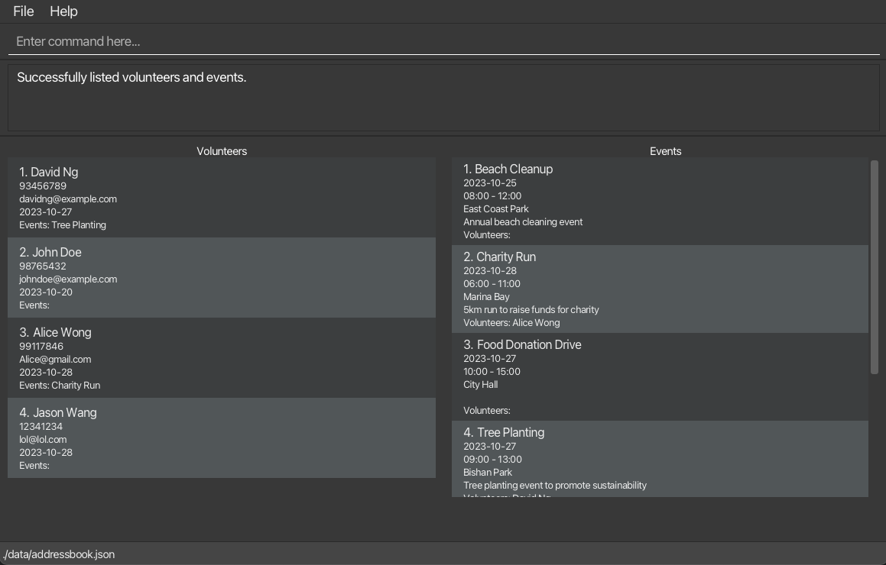
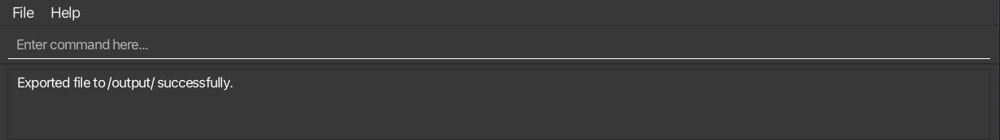
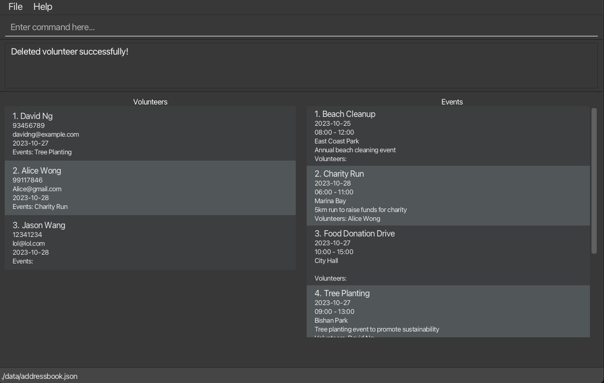
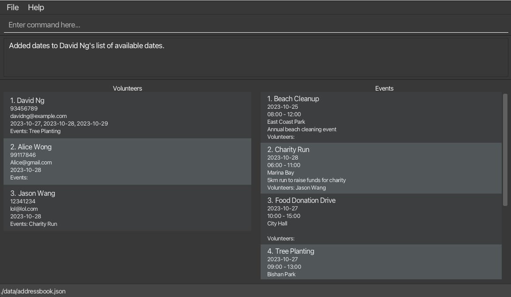
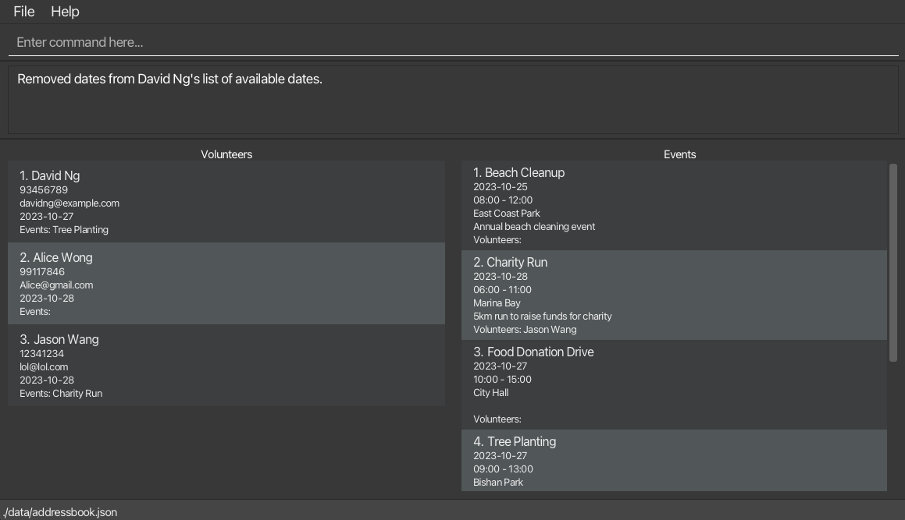
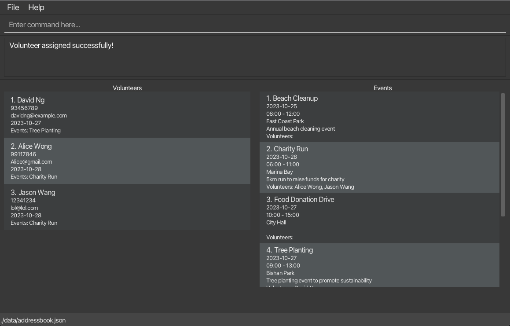
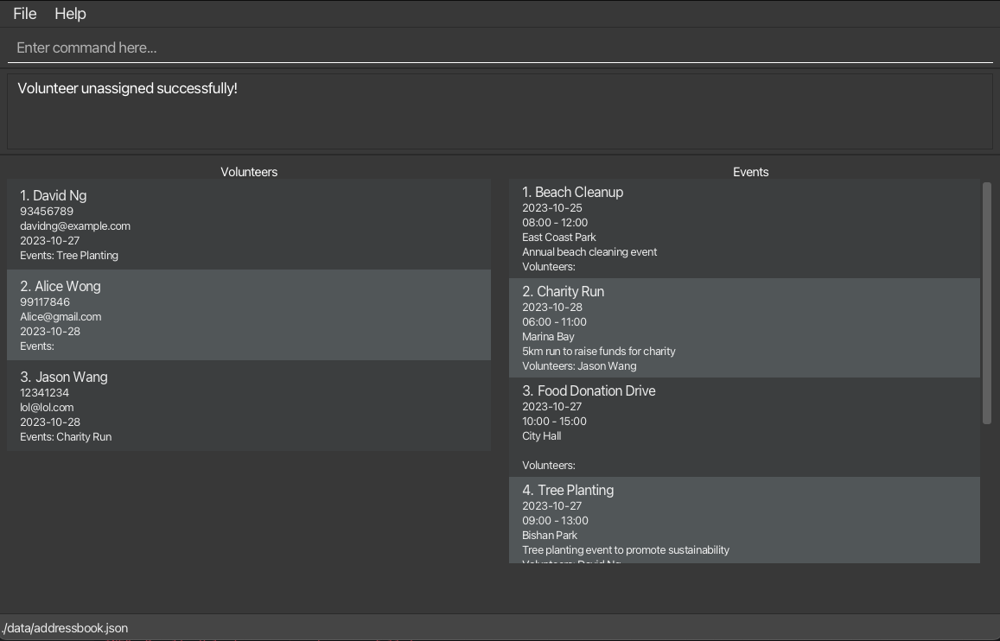
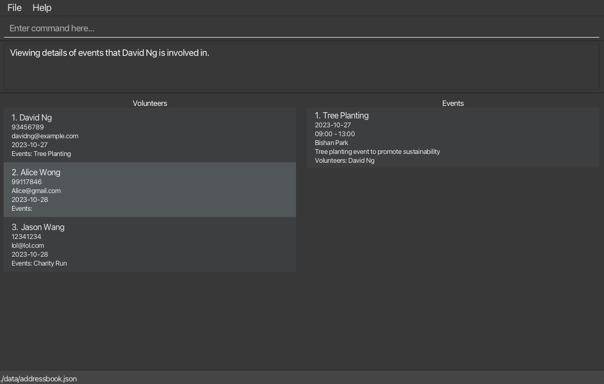

## What is VolunSync?
Welcome to VolunSync! We've created this friendly system specially for nonprofits to help manage their wonderful volunteers. Think of VolunSync as your helpful assistant that makes it easy to coordinate volunteers, organize events, keep track of hours, and stay in touch with everyone – all in one place.

## Quick Links
1. [Getting Started](#quick-start)
1. [Basic Guidelines](#command-format-guidelines)
1. [Everyday Tasks](#general-commands)
    1. [Getting Help](#viewing-help--help)
    1. [Seeing All Activities](#listing-all-volunteers-and-events--list)
    1. [Saving Records](#export-database-to-a-csv-file--export)
    1. [Closing the Program](#exiting-the-program--exit)
1. [Managing Volunteers](#volunteer-related-commands)
    1. [Adding New Volunteers](#adding-a-volunteer-v-new)
    1. [Finding Someone](#finding-volunteers-by-name--v-find)
    1. [Removing a Volunteer](#deleting-a-volunteer--v-del)
    1. [Adding Available Dates](#adding-available-dates-to-a-volunteer-v-free)
    1. [Removing Available Dates](#removing-available-dates-from-a-volunteer-v-unfree)
    1. [Signing Up for Events](#assigning-a-volunteer-to-event-assign)
    1. [Withdrawing from Events](#unassigning-a-volunteer-from-an-event-unassign)
    1. [Checking a Volunteer's Schedule](#listing-all-events-a-volunteer-is-participating-in-v-view)
1. [Managing Events](#event-related-commands)
    1. [Creating a New Event](#adding-an-event-e-new)
    1. [Finding an Event](#finding-events-by-name--e-find)
    1. [Canceling an Event](#deleting-an-event--e-del-)
    1. [Checking Event Attendance](#listing-all-volunteers-participating-in-an-event-e-view)
    1. [Finding Available Helpers](#filtering-volunteers-by-availability-for-an-event-e-filter)
1. [Quick Reference](#command-summary)

## Additional Help
1. [Common Questions](#faq)
1. [Technical Issues](#known-issues)
1. [About Saving Your Work](#saving-the-data)

--------------------------------------------------------------------------------------------------------------------

## Quick Start

Let's get you started with VolunSync! Just follow these simple steps:

1. **Check if You Have Java**
   First, let's make sure your computer has Java 17 or newer:
    - Open your computer's command window:
        - On Windows: Press the Windows key and 'R' together, type `cmd`, and press Enter
        - On Mac/Linux: Find and open "Terminal" in your Applications
    - Type this command: `java -version`
    - If you see something like `java version "17.x.x"` or higher, you're ready to go!
    - If not:
        - Visit [Oracle's website](https://www.oracle.com/java/technologies/javase-jdk17-downloads.html) or [OpenJDK](https://openjdk.org/) to get Java 17
        - Follow their simple installation steps
    - After installing, check again with `java -version` to make sure it worked

2. **Get VolunSync**
    - Download the latest version [here](https://github.com/AY2425S1-CS2103T-W12-2/tp/releases)
    - Put the downloaded file in any folder where you'd like to keep VolunSync

3. **Start VolunSync**
    - Open your computer's command window
    - Type `cd` and the location of your VolunSync folder
    - Type `java -jar` and the name of the file (like `java -jar volunsync-v1.5.jar`)

4. **You're Ready!**
   When you see this window, you're all set to begin:
   

5. **Try It Out**
   Type these commands to get started:
    * `help` - Opens this guide
    * `list` - Shows everyone and everything in your VolunSync family
    * `/v new n/John Doe p/91234567 em/john@gmail.com d/2024-02-02` - Welcomes John as a new volunteer
    * `/e new n/Food Drive l/Community Center d/2024-11-29 s/09:00 e/17:00 des/Monthly food collection` - Creates a new event

1. Refer to the [Command Format](#command-format) below for details of each command.

[Back To Top :arrow_heading_up:](#learn-about-commands-supported-by-volunsync)

--------------------------------------------------------------------------------------------------------------------

## Command Format Guidelines

**:information_source: Helpful Tips for Using Commands:**

Let's go over some simple guidelines that will help you use VolunSync easily:

* When you see `UPPERCASE` words, that's where you'll put your own information.
  For example, in `n/NAME`, you might type `n/John Doe`

* Don't worry about the order! If a command asks for `n/NAME p/PHONE_NUMBER`, you can type them in any order:
  `p/91234567 n/John Doe` works just as well

* Square brackets `[ ]` mean optional items.
  For example, in an event description [des/DESCRIPTION], you can skip it if you don't need it

* No need to worry about extra spaces at the start or end of your typing - VolunSync handles that for you

* When counting characters (like for names or descriptions), spaces count too:
<pre>
 "AB"   = 2 characters
 "A B"  = 3 characters
 "A  B" = 4 characters
</pre>

* Simple commands like `help` will work even if you accidentally type extra things after them

## General Commands

### Viewing Help : `help`

Need a hand? Just type `help` to open this guide in your web browser. You can also click the help button at the top of the window or press the F1 key.

Format: `help`

### Listing All Activities : `list`

Want to see everyone and everything? The `list` command shows all your volunteers and events. It's especially useful after you've been searching or filtering - it brings back the full view.

Format: `list`

### Saving Records : `export`

Need to share your records or print them out? The `export` command saves everything into easy-to-read files.

Format: `export`

After using this command:
1. Look for a new folder called `/output` where you keep VolunSync
2. You'll find two files:
    - `events.csv` - All your event information
    - `volunteers.csv` - All your volunteer information

### Closing the Program : `exit`

Ready to finish up? Just type `exit` to close VolunSync safely.

Format: `exit`

## Managing Your Volunteers

### Adding a New Volunteer: `/v new`

Welcome a new volunteer to your team!

Format: `/v new n/NAME p/PHONE_NUMBER em/EMAIL d/AVAILABLE_DATE`

What you'll need:
- Name: Letters, numbers, and spaces (up to 100 characters)
- Phone Number: Just numbers (3-15 digits)
- Email: Standard email format (like name@email.com)
- Date: YYYY-MM-DD (like 2024-01-01)
* `/v new n/John Doe p/91234567 em/john@gmail.com d/2024-02-02`  creates a volunteer record for `John Doe` with the specified details

### Finding Someone: `/v find`

Looking for a particular volunteer? This command helps you find them by name.

Format: `/v find KEYWORD`

Tips:
* It doesn't matter if you use capital or small letters
* It finds parts of names too - typing "Tan" can find "Stanley" or "Tanya"
* If no one is found, you'll see all volunteers again

Example:
* `/v find ng` returns `David Ng`, `Alice Wong` and `Jason Wang`

### Removing a Volunteer: `/v del`

When a volunteer leaves, you can remove their record.

Format: `/v del INDEX`

* The INDEX is the number you see next to their name in the list
* Use `list` first if you need to see everyone's numbers

Example:
* `/v del 2` removes the second volunteer from your list

### Adding Available Dates: `/v free`

Update when a volunteer is available to help.

Format: `/v free INDEX d/DATES`

* Use the number (INDEX) next to the volunteer's name
* For multiple dates, separate them with commas
* Use YYYY-MM-DD format (like 2024-01-01)

Example:
* `/v free 1 d/2024-10-28, 2024-10-29`

### Removing Available Dates: `/v unfree`

Need to mark dates when a volunteer isn't available anymore?

Format: `/v unfree INDEX d/DATES`

Example:
* `/v unfree 1 d/2024-10-28, 2024-10-29`

### Signing Up for Events: `assign`

Connect volunteers with events they'd like to join.

Format: `assign v/VOLUNTEER_INDEX e/EVENT_INDEX`

* Use the numbers shown next to both the volunteer and event names
* The system checks if the volunteer is free on that date
* It also makes sure they aren't already signed up for another event at the same time

Example:
* `assign v/3 e/2` signs up volunteer #3 for event #2

### Withdrawing from Events: `unassign`

If a volunteer needs to step back from an event:

Format: `unassign v/VOLUNTEER_INDEX e/EVENT_INDEX`

Example:
* `unassign v/2 e/2`

### Checking a Volunteer's Schedule: `/v view`

Want to see which events a volunteer is joining? This command shows you everything they're signed up for.

Format: `/v view INDEX`

* Just use the number (INDEX) you see next to their name in the list
* After you're done, type `list` to see everyone again

Example:
* `/v view 1` shows all the events your first volunteer is helping with

## Managing Your Events

### Creating a New Event: `/e new`

Planning a new activity? Here's how to add it to VolunSync.

Format: `/e new n/EVENT_NAME l/LOCATION d/DATE s/START_TIME e/END_TIME [des/DESCRIPTION]`

What you'll need:
- Event Name: Letters, numbers, and spaces (up to 50 characters)
- Location: Where it's happening (up to 100 characters)
- Date: YYYY-MM-DD (like 2024-01-01)
- Start Time: 24-hour format (like 09:00 for 9 AM)
- End Time: 24-hour format (like 17:00 for 5 PM)
- Description: Optional - add any helpful details (up to 100 characters)

Examples:
* `/e new n/Food Drive l/Community Center d/2024-02-14 s/09:00 e/16:00 des/Monthly food collection drive`
* `/e new n/Garden Party l/Senior Center d/2024-08-09 s/12:00 e/15:00`

### Finding an Event: `/e find`

Looking for a particular event? This command helps you find it by name.

Format: `/e find KEYWORD`

Tips:
* Don't worry about capital or small letters
* It finds partial matches too - typing "food" can find "Food Drive" or "Seafood Party"
* If nothing matches, you'll see all events again

Example:
* `/e find beach` returns `Beach Cleanup` and `beach clean2`

### Canceling an Event: `/e del`

Need to remove an event from the calendar?

Format: `/e del INDEX`

* Use the number (INDEX) shown next to the event name
* This will automatically notify all volunteers who signed up

Example:
* `/e del 2` removes the second event from your list

### Checking Event Attendance: `/e view`

Want to see who's coming to an event?

Format: `/e view INDEX`

* Use the number (INDEX) next to the event name
* Type `list` afterwards to see everything again

Example:
* `/e view 1` shows all volunteers signed up for your first event

### Finding Available Helpers: `/e filter`

Need to find volunteers who are free for a specific event?

Format: `/e filter INDEX`

* Use the number (INDEX) next to the event name
* This shows only volunteers who:
    - Are available on that day
    - Aren't already busy with another event
    - Haven't signed up for this event yet

Example:
* `/e filter 1` shows all volunteers who could help with your first event

## Saving Your Work

Don't worry about saving - VolunSync automatically saves everything you do! Every change you make is safely stored on your computer.

## Common Questions

**Q**: Oops! Can I undo something I just did?
**A**: Not yet, but we're working on adding an 'undo' feature in our next update. Stay tuned!

## Technical Issues

1. **Using Multiple Screens?**
   If you move VolunSync to a second screen and later disconnect it:
    - The program might open off-screen next time
    - To fix this, just find and delete the `preferences.json` file
    - Start VolunSync again, and it'll open on your main screen

2. **Help Window Stays Hidden?**
   If you minimize the help window and can't get it back:
    - Look for it in your taskbar and click to bring it back up
    - Or close it completely and type `help` again

We're always working to make VolunSync better and easier to use. Keep an eye out for updates!

## Quick Reference Guide

### Everyday Tasks
| What You Want To Do | How To Do It | Example  |
|---------------------|--------------|----------|
| See everything      | `list`       | `list`   |
| Save records        | `export`     | `export` |
| Get help            | `help`       | `help`   |
| Close program       | `exit`       | `exit`   |

### Managing Volunteers
| What You Want To Do | How To Do It                               | Example                                                       |
|---------------------|--------------------------------------------|---------------------------------------------------------------|
| Add new volunteer   | `/v new n/NAME p/PHONE em/EMAIL d/DATE`    | `/v new n/Mary Tan p/91234567 em/mary@gmail.com d/2024-02-02` |
| Find someone        | `/v find KEYWORD`                          | `/v find tan`                                                 |
| Remove volunteer    | `/v del INDEX`                             | `/v del 1`                                                    |
| Add available dates | `/v free INDEX d/DATES`                    | `/v free 1 d/2024-11-28, 2024-11-29`                          |
| Remove dates        | `/v unfree INDEX d/DATES`                  | `/v unfree 1 d/2024-11-28, 2024-11-29`                        |
| Sign up for event   | `assign v/VOLUNTEER_INDEX e/EVENT_INDEX`   | `assign v/1 e/2`                                              |
| Withdraw from event | `unassign v/VOLUNTEER_INDEX e/EVENT_INDEX` | `unassign v/1 e/2`                                            |
| Check schedule      | `/v view INDEX`                            | `/v view 1`                                                   |

### Managing Events
| What You Want To Do    | How To Do It                                                      | Example                                                                       |
|------------------------|-------------------------------------------------------------------|-------------------------------------------------------------------------------|
| Create new event       | `/e new n/NAME l/LOCATION d/DATE s/START e/END [des/DESCRIPTION]` | `/e new n/Food Drive l/Center d/2024-12-12 s/09:00 e/17:00 des/Monthly drive` |
| Find an event          | `/e find KEYWORD`                                                 | `/e find food`                                                                |
| Cancel event           | `/e del INDEX`                                                    | `/e del 1`                                                                    |
| Check attendance       | `/e view INDEX`                                                   | `/e view 1`                                                                   |
| Find available helpers | `/e filter INDEX`                                                 | `/e filter 1`                                                                 |

[Back To Top](#quick-links)